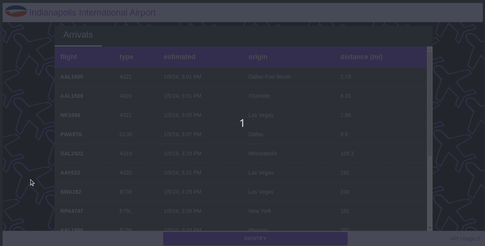

# Sky is Open

This is an aircraft identification tool for my own personal use.

#### Full-stack webapp with Spring Boot and Angular 17.

(Note: You must add a AeroAPI key in the password.properties file to be able to retrieve information)

## Background

Indianapolis International Airport (KIND) is 8 miles from my apartment, and approaches for the parallel runways are
2 and 3 miles away, so I have a clear view of the aircraft when the cloud base is above 2000ft (609m).
The larger planes sometimes grab my attention, and I become curious about their origin.
There are plenty of free sites that give this information, though looking up each one becomes toilsome.
This app uses [AeroAPI](https://www.flightaware.com/aeroapi/portal/documentation "FlightAware AeroAPI") 
and calculates which plane(s) are at the point closest to my apartment when they are lined up with a runway.

My first iterations of this project kept track of all the approaching aircraft so I would have realtime notifications every time a plane was at the "sweet spot."
Since making that many AeroAPI calls can get expensive fairly quickly, I have tried various algorithms to better time when to call the API.
Though I have had some success using distance and speed to minimize information gathering, it has been less reliable since planes do not always fly the same flight pattern.

Now that this page somewhat usable and reliable for me, it would be fun to continue developing ways to better automate it for cheap and reliable real-time results.

## System

Since it is not a good idea for a website to get information directly from a server on a different domain, many APIs limit Cross-Origin Resource Sharing (CORS).
To get the information properly, I set up a simple Spring Boot REST API that communicates with AeroAPI endpoints.
Though it is basically a pass-through backend, I did set up some safeguards against accessing AeroAPI too often
(the limit is 10 calls per minute, and they charge you without giving you the data if you exceed that).

Before I deploy this, I will add authentication so others are unable to rack up a tab. :)
